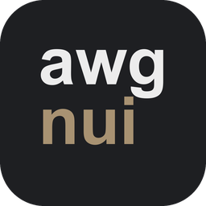
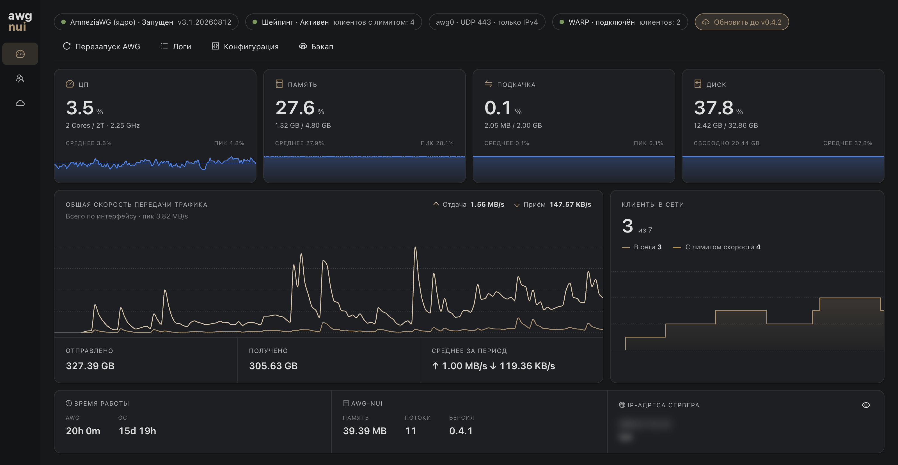
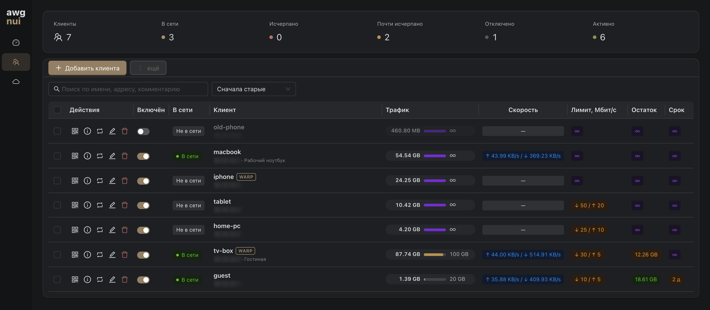
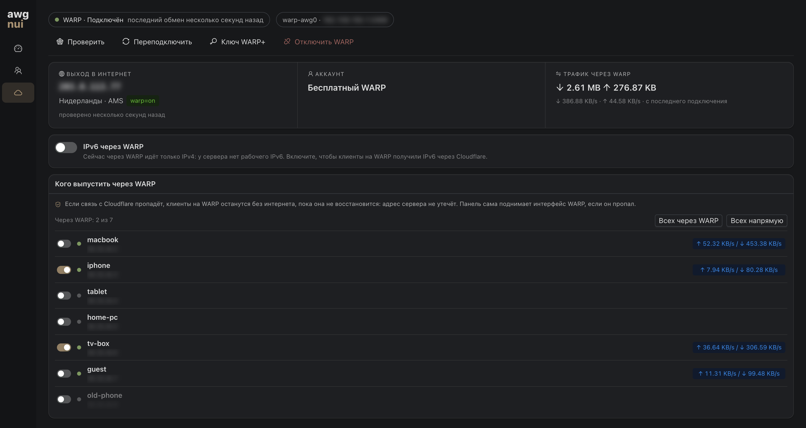
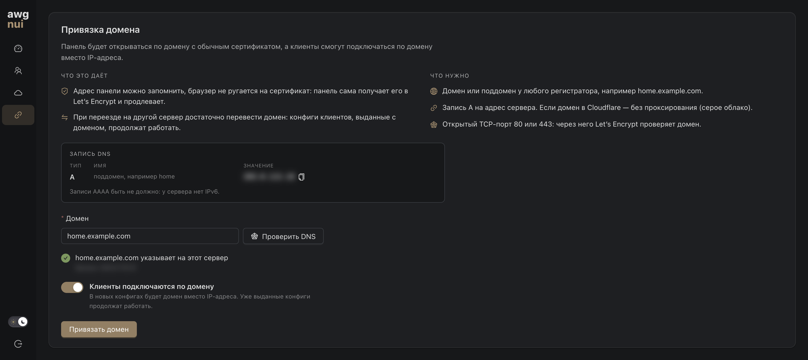
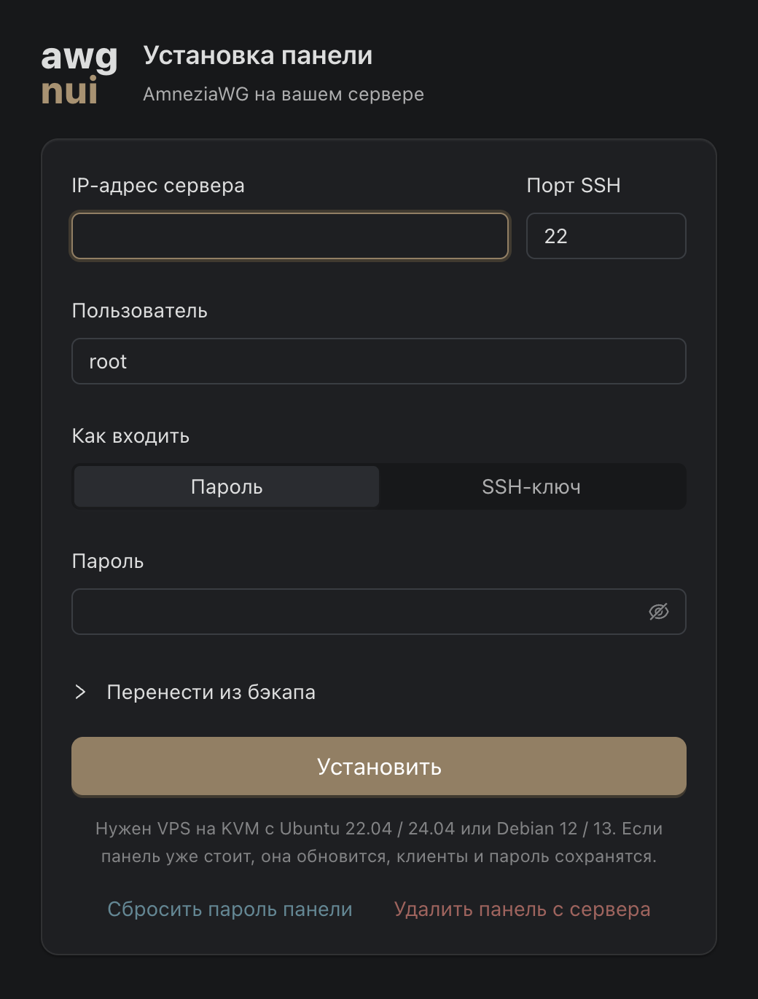
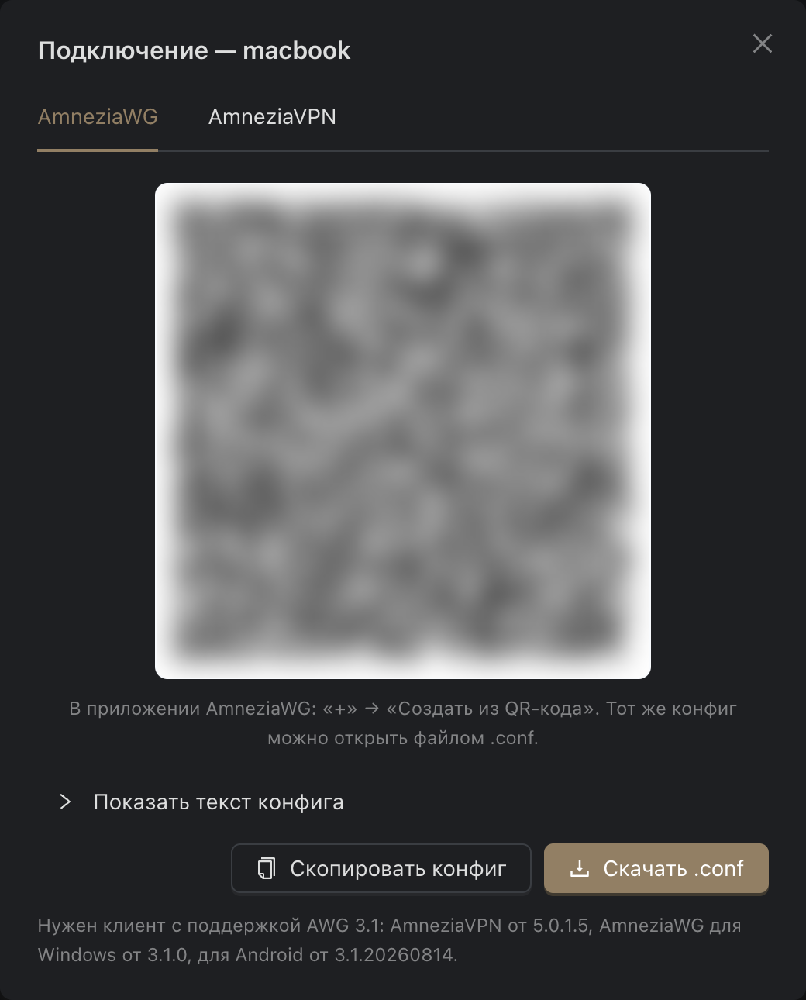

<p align="center">
  
</p>

<h1 align="center">awg-nui</h1>

<p align="center">
  Веб-панель для управления сервером AmneziaWG.<br>
  Устанавливается на ваш сервер за несколько минут, без командной строки.
</p>

<p align="center">
  <a href="https://github.com/igorkuznecov/awg-nui-releases/releases/latest/download/awg-nui-installer.exe"></a>
  <a href="https://github.com/igorkuznecov/awg-nui-releases/releases/latest/download/awg-nui-installer-macos.dmg"></a>
</p>

<p align="center">
  <a href="https://github.com/igorkuznecov/awg-nui-releases/releases/latest"></a>
  
</p>

<p align="center">
  
</p>

Установщик на вашем компьютере подключается к серверу по SSH и ставит на него AmneziaWG вместе с панелью управления. Дальше всё делается в браузере: добавляйте устройства, задавайте лимиты скорости и трафика, следите за нагрузкой сервера и за тем, какие устройства сейчас подключены.

[AmneziaWG](https://amnezia.org) — протокол защищённых сетевых туннелей на основе WireGuard. Подключаться к серверу можно из приложений AmneziaWG и AmneziaVPN на телефоне, компьютере и ТВ-приставке на Android.

## Что умеет

- **Устройства в пару кликов.** Добавили клиента — получили QR-код и файл конфигурации для приложения.
- **Лимиты на каждого.** Скорость, объём трафика и срок действия задаются отдельно для каждого устройства. Удобно для гостевого доступа на неделю или для ТВ-приставки, которая не должна забирать весь канал.
- **Cloudflare WARP для выбранных устройств.** Отдельным устройствам можно назначить выход в интернет через сеть Cloudflare WARP вместо адреса сервера. Ничего доустанавливать не нужно.
- **Свой домен.** Панель подскажет, какую запись DNS создать, проверит её и сама получит сертификат на домен. Устройства тоже можно подключать по домену: тогда при переезде на другой сервер достаточно перенаправить домен, выданные конфигурации продолжат работать.
- **Безопасность.** Панель работает по HTTPS с сертификатом Let's Encrypt и открывается только по секретной ссылке. Устройства изолированы друг от друга и от внутренних сетей хостера, отправка почты напрямую через порт 25 закрыта.
- **Обновление одной кнопкой.** Новая версия ставится прямо из панели, подключения устройств при этом не прерываются.
- **Бэкап и переезд.** Все клиенты и настройки в одном файле; на новом сервере установщик поднимет всё как было.
- **IPv6**, если он есть у сервера, или через WARP.

## Как это выглядит

<p align="center">
  
  <br><sub>Клиенты: трафик, скорость, лимиты и сроки действия</sub>
</p>

<p align="center">
  
  <br><sub>Выход через Cloudflare WARP для выбранных устройств</sub>
</p>

<p align="center">
  
  <br><sub>Привязка домена: какую запись создать и проверка перед привязкой</sub>
</p>

## Что понадобится

- **Сервер (VPS)** с Ubuntu 22.04 / 24.04 или Debian 12 / 13 на виртуализации KVM. Хватит недорогого тарифа с одним ядром. OpenVZ и LXC не подойдут: для AmneziaWG нужен модуль ядра.
- **Доступ к серверу по SSH** под root или под пользователем с sudo: адрес и пароль (или SSH-ключ) хостер присылает после покупки.
- **Приложение на устройствах** с поддержкой AmneziaWG 3.1: AmneziaWG для Windows 3.1.0 и новее, для Android 3.1.20260814 и новее или AmneziaVPN 5.0.1.5 и новее.

## Установка



### С Windows

1. Скачайте [`awg-nui-installer.exe`](https://github.com/igorkuznecov/awg-nui-releases/releases/latest/download/awg-nui-installer.exe).
2. Запустите его. Файл не подписан, поэтому Windows покажет предупреждение SmartScreen: нажмите «Подробнее» → «Выполнить в любом случае».
3. Введите IP-адрес сервера и пароль root (или выберите SSH-ключ) и нажмите «Установить».
4. В конце установщик покажет ссылку на панель, логин и пароль. **Пароль показывается один раз — сохраните его.**

### С Mac

1. Скачайте [`awg-nui-installer-macos.dmg`](https://github.com/igorkuznecov/awg-nui-releases/releases/latest/download/awg-nui-installer-macos.dmg), откройте его и перетащите «awg-nui installer» в «Программы». Подходит для Mac на Apple Silicon и на Intel.
2. Приложение не заверено Apple, поэтому при первом запуске macOS откажется его открывать. Откройте «Системные настройки» → «Конфиденциальность и безопасность», внизу нажмите «Всё равно открыть» и подтвердите. На macOS 14 и более ранних версиях достаточно правого клика по приложению → «Открыть».
3. Дальше всё как на Windows. SSH-ключ можно указать путём вида `~/.ssh/id_ed25519`.

<br clear="right">

### Из терминала сервера

Если под рукой нет ни Windows, ни Mac, зайдите на сервер по SSH и выполните под root:

```bash
cd /tmp
curl -fLO https://github.com/igorkuznecov/awg-nui-releases/releases/latest/download/install.sh
curl -fLO https://github.com/igorkuznecov/awg-nui-releases/releases/latest/download/awg-nui-linux-amd64
bash install.sh
```

Для сервера на ARM замените `awg-nui-linux-amd64` на `awg-nui-linux-arm64`. В конце установщик напечатает ссылку на панель, логин и пароль.

<details>
<summary>Параметры установки</summary>

<br>

Всё подбирается само, но при желании можно задать вручную:

| Параметр | Что делает |
|---|---|
| `--endpoint ADDR` | Адрес, к которому подключаются устройства (домен удобнее привязать позже в разделе «Домен») |
| `--awg-port N` | UDP-порт AmneziaWG (по умолчанию подбирается сам) |
| `--panel-port N` | TCP-порт панели (по умолчанию случайный свободный) |
| `--cert self-signed` | Самоподписанный сертификат панели вместо Let's Encrypt |
| `--ipv6 off` | Не выдавать устройствам IPv6 |
| `--restore FILE` | Поднять панель из бэкапа другого сервера |

Например: `bash install.sh --awg-port 51820 --cert self-signed`.

</details>

## Первое устройство



1. Откройте ссылку на панель и войдите с логином и паролем из установщика.
2. В разделе «Клиенты» нажмите «Добавить клиента» и назовите устройство. Лимиты и срок действия можно задать сразу или позже.
3. Нажмите значок QR-кода в строке клиента и отсканируйте его в приложении. На компьютере удобнее скачать файл `.conf` и открыть его в приложении.

<br clear="right">

## Обновление

Когда выходит новая версия, на дашборде появляется кнопка «Обновить до …»: панель обновится сама, клиенты и настройки сохранятся, подключения устройств не прервутся. Тот же установщик тоже обновляет панель, если запустить его ещё раз для того же сервера.

Панели версии 0.1.0 один раз обновляются установщиком, дальше — кнопкой.

## Частые вопросы

<details>
<summary><b>Забыл пароль от панели</b></summary>

<br>

В установщике введите данные сервера и нажмите «Сбросить пароль панели». Или на сервере выполните `awg-nui passwd`: команда напечатает новый пароль.

</details>

<details>
<summary><b>Потерял ссылку на панель</b></summary>

<br>

На сервере выполните `awg-nui info`, ссылка — в поле `panelUrl`. Ещё её показывает установщик после повторного запуска для того же сервера.

</details>

<details>
<summary><b>Как открыть панель по своему домену</b></summary>

<br>

1. У регистратора домена создайте запись A со значением IP-адреса сервера, например для поддомена `home.example.com`. Если домен в Cloudflare, выключите для записи проксирование (серое облако).
2. В панели откройте раздел «Домен», введите домен и нажмите «Проверить DNS». Если запись ещё не разошлась, подождите несколько минут и проверьте снова.
3. Нажмите «Привязать домен». Примерно через минуту панель получит сертификат Let's Encrypt и будет открываться по адресу вида `https://home.example.com:порт/секретный-путь/`. Для выпуска сертификата на сервере должен быть открыт TCP-порт 80 или 443.

Переключатель «Клиенты подключаются по домену» ставит домен вместо IP-адреса в новые конфигурации устройств. Уже выданные продолжают работать как есть.

</details>

<details>
<summary><b>Как переехать на другой сервер</b></summary>

<br>

1. В старой панели на дашборде нажмите «Бэкап» и сохраните файл.
2. В установщике укажите новый сервер, раскройте «Перенести из бэкапа», выберите файл и нажмите «Установить». Из терминала то же самое: `bash install.sh --restore файл-бэкапа.json`.

Клиенты, их лимиты, привязанный домен и пароль от панели переедут вместе с сервером. Если у нового сервера другой IP-адрес, устройствам нужно заново выдать конфигурацию. Если устройства подключаются по домену (раздел «Домен»), достаточно перенаправить запись A на новый адрес.

</details>

<details>
<summary><b>Как удалить панель</b></summary>

<br>

В установщике нажмите «Удалить панель с сервера». Из терминала: `bash install.sh uninstall`.

</details>

<details>
<summary><b>Что ставится на сервер</b></summary>

<br>

Модуль ядра AmneziaWG из официального репозитория Amnezia и сама панель: один файл `/opt/awg-nui/awg-nui` и системная служба `awg-nui`. Docker не нужен. Данные панели лежат в `/var/lib/awg-nui`.

</details>

<details>
<summary><b>Как проверить скачанные файлы</b></summary>

<br>

В каждом релизе есть `SHA256SUMS`. Положите его рядом со скачанными файлами и выполните `shasum -a 256 -c SHA256SUMS --ignore-missing` на Mac или `sha256sum -c SHA256SUMS --ignore-missing` на Linux.

</details>

## Файлы релиза

| Файл | Что это |
|---|---|
| `awg-nui-installer.exe` | Установщик для Windows, внутри всё остальное |
| `awg-nui-installer-macos.dmg` | Установщик для macOS (Apple Silicon и Intel), внутри всё остальное |
| `awg-nui-linux-amd64`, `awg-nui-linux-arm64` | Панель для сервера, интерфейс встроен |
| `install.sh` | Установка, обновление и удаление на сервере |
| `SHA256SUMS` | Контрольные суммы файлов выше |

Все версии и списки изменений — на странице [релизов](https://github.com/igorkuznecov/awg-nui-releases/releases).
